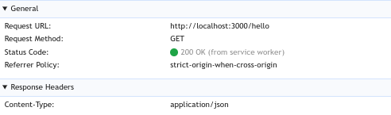

ウェブサイトを PWA に変換することでネイティブアプリのようにホーム画面にインストールすることができるようになりますが、それだけでは中身はただのウェブサイトへのブックマークに過ぎません。
例えばオフラインの環境では「ページを開けません」といった表示になり、全くアプリっぽさがありません。

Service Worker という技術を用いることにより、ウェブサイトをオフラインで動作させたりプッシュ通知を処理することができ、ネイティブアプリと同等の体験を提供することができます。
Service Worker 自体は PWA とは独立した概念であり、PWA に Service Worker が必須というわけではありませんが、両者はいっしょに用いられることが多いです。

:::tip
以前は Service Worker がないと PWA アプリとして認識されなかったようです (そう書かれている記事が多いです) が、現在 (2025年4月現在) はそんなことはありません。
:::

## Service Worker の基本

Service Worker はウェブページとは独立して動作する JavaScript のコードです。

以下に例を示します。

```html title="index.html"
<html>
  <head>
    <title>SW sample</title>
  </head>
  <body>
    hello, world!
    <script>
      // serviceWorker が実装されていない古いブラウザではなにもしない
      if ("serviceWorker" in navigator) {
        navigator.serviceWorker.register("/sw.js");
      }
    </script>
  </body>
</html>
```

```js title="sw.js"
self.addEventListener("install", (event) => {
  console.log("sw.js: install");
  self.skipWaiting();
});
self.addEventListener("activate", (event) => {
  console.log("sw.js: activate");
  event.waitUntil(self.clients.claim());
});
self.addEventListener("fetch", (event) => {
  console.log("sw.js: fetch");
});
```
:::caution
* サービスワーカーを登録するには、ウェブサイトが HTTPS または localhost (ポートは任意) でホストされている必要があります。
* サービスワーカーの js ファイルはページと同じオリジンになければなりません。
* サービスワーカーの js ファイルはオリジンの直下のパスに置きましょう。 (`https://example.com/sw.js` は OK、 `https://example.com/public/sw.js` はダメ)
    * サービスワーカーは自身の js ファイルが置かれているのと同じ階層かそれ以下のページに対してしか「制御」しないためです。
* サービスワーカーの install, activate イベントハンドラの中で非同期関数を呼び出す場合、イベントハンドラを async 関数にするのではなく、
    ```js
    event.waitUntil(promise);
    ```
    と記述し promise の完了までイベントを延長する必要があります。([ExtendableEvent.waitUntil](https://developer.mozilla.org/ja/docs/Web/API/ExtendableEvent/waitUntil))
:::

:::tip
* サービスワーカーはクライアントで動作する js ファイルなので、モジュールを import したり TypeScript を使いたい場合には、フロントエンド開発の場合と同様 webpack 等を用いて js ファイルにバンドルする必要があります。おそらく設定ファイルもソースコードもフロントエンドとは分けて扱うことになるでしょう。
* TypeScript で `self` の型を認識させるためには
    ```ts
    declare const self: ServiceWorkerGlobalScope;
    ```
    と書きます。
    * また、 `tsconfig.json` に `"lib": ["WebWorker"]` が必要です。
:::

### 初回アクセス時

* このページを開くと、 [`navigator.serviceWorker.register()`](https://developer.mozilla.org/ja/docs/Web/API/ServiceWorkerContainer/register) を呼び出すことにより、サービスワーカーとして実行するファイルを登録します。
    * 返り値は [ServiceWorkerRegistration](https://developer.mozilla.org/ja/docs/Web/API/ServiceWorkerRegistration) のプロミスで、サービスワーカーがインストール中かどうか、アクティブかどうかなどの情報が得られます。
* ブラウザは sw.js をフェッチし、サービスワーカーとして実行します。
    * sw.js では `self` に対して install イベント、 activate イベント、 fetch イベント のイベントハンドラーを設定します。
    * この `self` は [ServiceWorkerGlobalScope](https://developer.mozilla.org/ja/docs/Web/API/ServiceWorkerGlobalScope) 型です。
* 初回の実行なので、まずサービスワーカーが「インストール」され、 install イベントが実行されます。
* install イベントが完了したらサービスワーカーは「有効化」され、 activate イベントが実行されます。
* activate イベントが完了したら以降このサービスワーカーが有効でありページを「制御」できるようになります。具体的に何ができるかは後述します。
    * ページを閉じたり新しいタブでページを開いたりしても、有効化されたサービスワーカーは有効のままです。

### 2回目以降のアクセス時

* ページを開いた際、ブラウザは再度 sw.js をフェッチします。
    * この例では `navigator.serviceWorker.register()` が再度実行されますが、実行してもしなくても同じです。
* もしフェッチした sw.js の中身が変わっていなければ、何もしません (すでに有効化されているサービスワーカーが有効なままです)
* もしフェッチした sw.js の中身が1文字でも変わっている場合、新しいサービスワーカーが「インストール」され、 install イベントが実行されます。
この間以前のサービスワーカーは有効なままです。
* 初回と異なり、以前のサービスワーカーによって制御されているページ (タブ) がすべて閉じられるまでの間、新しいサービスワーカーの有効化は始まりません。
    * install イベントハンドラーの中で [`self.skipWaiting()`](https://developer.mozilla.org/ja/docs/Web/API/ServiceWorkerGlobalScope/skipWaiting) を呼び出すことにより、これをスキップすることが可能です。
        * `skipWaiting()` はプロミスを返しますが、 await や waitUntil() する必要はないです。
* 新しいサービスワーカーが「有効化」され、 activate イベントが実行されます。
* 初回と異なり、activate イベントが完了したあとこのサービスワーカーがページを「制御」するのは `register()` が成功したあとに開かれたページに対してのみです。
    * ウェブページと Service Worker を両方変更した場合に、整合性をとるためですかね。
    * activate イベントハンドラの中で [`self.clients.claim()`](https://developer.mozilla.org/ja/docs/Web/API/Clients/claim) を呼び出すことにより、すでに開いているページに対しても新しいサービスワーカーを適用することができます。
        * `claim()` はプロミスを返し、これを `event.waitUntil()` で待機する必要があります。

## サービスワーカーでページを制御する

サービスワーカーがページを「制御」するとは、クライアントからサーバーへのリクエスト (`fetch()` だけでなく &lt;img&gt; や &lt;script&gt; のソース、HTML 自体のリロードなども含めたすべて) に割り込んでプロキシーとして動作することです。


(画像は [Service Worker | web.dev](https://web.dev/learn/pwa/service-workers?hl=ja) より)

### レスポンスを返す

サービスワーカー内でリクエストを受け取りレスポンスを返すのは、 fetch イベントのイベントハンドラーです。
引数には [FetchEvent](https://developer.mozilla.org/ja/docs/Web/API/FetchEvent) が渡されます。
`event.request` で[リクエスト](https://developer.mozilla.org/ja/docs/Web/API/Request)が得られ、`event.respondWith(response)` で[レスポンス](https://developer.mozilla.org/ja/docs/Web/API/Response)を返します。

```js title="sw.js"
self.addEventListener("fetch", (event) => {
  const url = new URL(event.request.url);
  if (url.pathname === "/hello") {
    event.respondWith(Response.json({ message: "hello, world" }));
  }
});
```

サービスワーカーのインストールと有効化が完了したあとに `/hello` にアクセスしてみると、(サーバー側にはそんなリソースはないにも関わらず) サービスワーカーが返したメッセージが得られることがわかります。

また開発者ツールの Network タブを開くとサービスワーカーから返されたレスポンスはこのように表示されます。


`event.respondWith()` は同期的に (イベントハンドラが return する前に) 呼び出す必要があります。
以下のように非同期にレスポンスを返すことはできません。
```js
self.addEventListener("fetch", (event) => {
    doSomethingAsync().then(() => {
        event.respondWith(someResponse);
    });
});
```
`respondWith()` に Response で解決するプロミスを渡すことはできます。
```js
async function respondAsync() {
    await doSomethingAsync();
    return someResponse;
}
self.addEventListener("fetch", (event) => {
    event.respondWith(respondAsync());
});
```

`respondWith()` をせずに return した場合、クライアントは改めてサーバーにリクエストを送ります。
つまり、サービスワーカーが存在しなかった場合と同じ結果になります。

:::tip
[Hono](https://hono.dev/docs/getting-started/service-worker) などサービスワーカーで動作する Web サーバーフレームワークもあります。
:::

### キャッシュストレージ

サービスワーカーがページや静的なアセットファイルをストレージに保存しておき、サーバーの代わりにレスポンスを返すことで、端末がオフラインやネットワークが遅い環境でも高速にページを読み込むことができるようになります。
こういった用途のためサービスワーカー内で使えるストレージが [CacheStorage](https://developer.mozilla.org/ja/docs/Web/API/CacheStorage) です。 Request をキーとし、対応する Response を保存しておくことができます。

