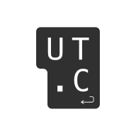
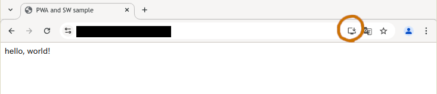
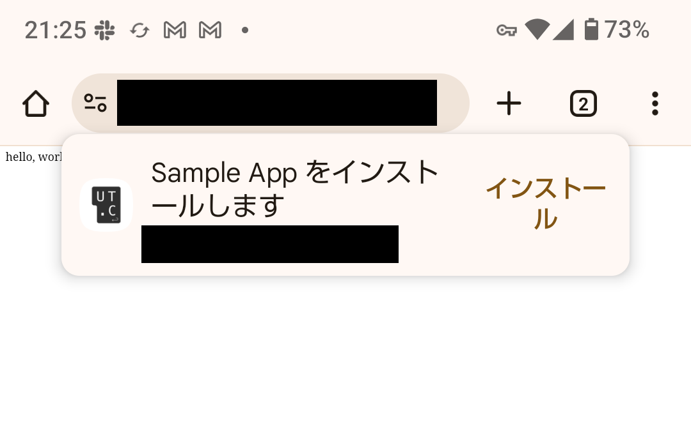
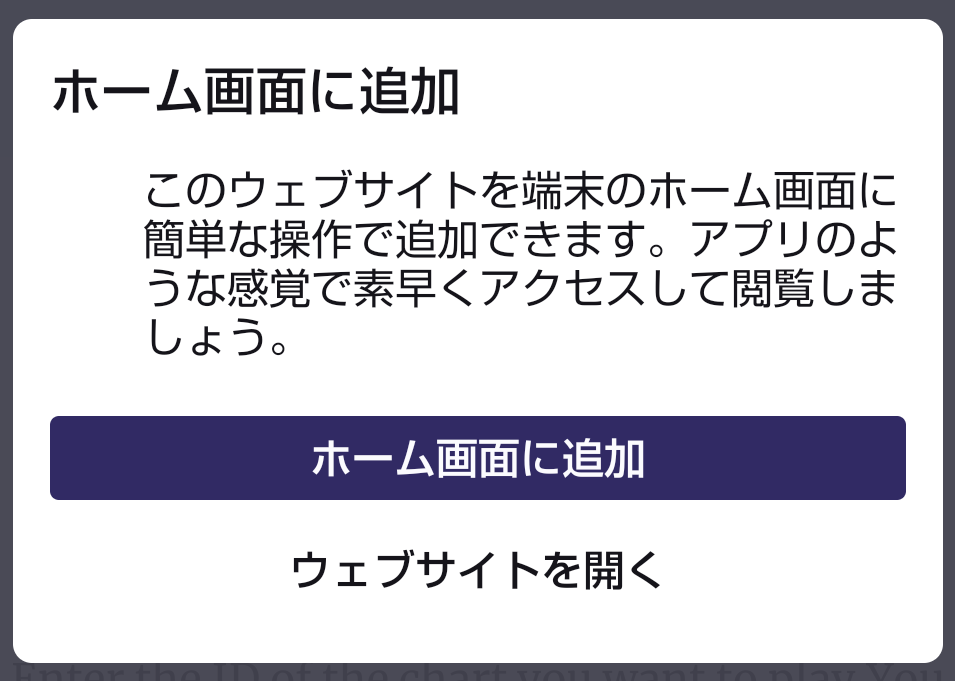

PWA (Progressive Web App) は、ウェブサイトをブラウザー内で利用するのではなく、端末にインストールしてアプリのように利用することができる技術です。
端的に言えばウェブサイトのブックマークをホーム画面に置くのと同じような感じですが、 PWA は単なるブックマークとは違いブラウザーとは独立した画面で(つまり、フルスクリーンで)開きます。
さらにそれに加えてオフラインでの利用や OS のプッシュ通知機能なども使用できるため、ネイティブアプリと同等の体験を提供することができます。

PWA のウェブサイトをオフラインで動作させたりプッシュ通知を処理するために用いられる技術が、Service Worker です。
Service Worker 自体は PWA とは独立した概念であり、PWA に Service Worker が必須というわけではありませんが、両者はいっしょに用いられることが多いです。

## PWA を作る

ウェブサイトを PWA として認識されるようにするために必要なのは、ウェブアプリマニフェストと呼ばれる json ファイルと、HTML ファイル内の数個のメタタグです。

ここでは例として、ウェブサイトが以下のような HTML ファイル1つからなるとします。

```html title="index.html"
<html>
  <head>
    <title>Sample App</title>
  </head>
  <body>
    hello, world!
  </body>
</html>
```

### ウェブマニフェスト

このウェブサイトを PWA にするためには、まず以下のような内容の「manifest.json」ファイルを作成します。

```json title="manifest.json"
{
  "name": "Sample App",
  "start_url": "/",
  "display": "standalone",
  "icons": [
    {
      "src": "/icon_192.png",
      "sizes": "192x192",
      "type": "image/png",
      "purpose": "any maskable"
    },
    {
      "src": "/icon_512.png",
      "sizes": "512x512",
      "type": "image/png",
      "purpose": "any maskable"
    },
  ]
}
```

そして、HTML の &lt;head&gt; 内に以下のようにマニフェストファイルの URL を記述します。

```html title="index.html"
<link rel="manifest" href="/manifest.json">
```

マニフェストファイルの内容としては上に示した項目が最低限必須なものですが、これ以外に `short_name` (ホーム画面で表示される略称) や `theme_color`、`background_color` などの項目を追加することもできます。
詳細は[こちら](https://web.dev/learn/pwa/web-app-manifest?hl=ja)

:::tip
* マニフェストファイルのファイル名や配置するパスに決まりはありませんが、「manifest.json」や「〜.webmanifest」がよく用いられます。
* 複数のページからなるウェブサイトの場合、すべてのページにマニフェストファイルのlinkタグを記述する必要があります。
* 生で HTML を書かずにフレームワークを使う場合、静的なアセットとしてマニフェストファイルを置いてもよいですが、フレームワークの API でマニフェストを作成する機能が用意されている場合もあります。
:::

### アイコン

端末のホーム画面に表示されるアプリアイコンを用意する必要があります。
アイコンはマニフェストファイルの `icons` で指定します。
PNG 形式で 192x192 と 512x512 のアイコン画像を最低限用意しないと Chrome で動作しないようです。

Android ではアプリアイコンの形が丸や角丸など異なる場合があります。
これに対応させるために、 `purpose` を `maskable` に設定したマスク可能なアイコンを用意する必要があります。
マスク可能なアイコンは、OS 側によって周囲がカットされても構わないよう、アイコンのメインの部分が直径約 80% の円の内側に収まるようにデザインします。
また画像は透過でないほうがよいらしいです。



PC などその他の環境ではそのようなパディングは必要ないので、 `purpose` を `any` に設定した通常のアイコンも用意します。
複数種類のアイコンを用意するのが面倒な場合は前述の例のように `any maskable` とすることもできます。

最低でも1つ以上は `purpose` が `any` のアイコンが必須です。(サイズは問わないらしい?)

iOS ではウェブマニフェストとは別に HTML のメタタグで `apple-touch-icon` を指定する必要があると書かれている記事が多いですが、この記事を書いている現在 (2025年4月) iOS 18 で試してみたところウェブマニフェストだけでも正しくアイコンが表示されました。

## PWA のインストール

以上のようにマニフェストファイルが正しく用意されていれば、ウェブサイトをPWAとしてインストールできるはずです。
PWA をインストールするには、ウェブサイトが HTTPS または localhost でホストされている必要があります。
PC での動作確認は localhost で行えばよいですが、スマホ等別の端末での動作確認をするには https が使えるようにデプロイする必要があります。

### PC の Chrome の場合

PC の Chrome では、PWA に対応したウェブサイトを開くと、アドレスバーの右側に「インストール」ボタンが出現します。
Chrome 以外のブラウザでは (同じ Chromium ベースであっても) 仕様が異なる場合があるため、まず Chrome での動作確認をおすすめします。



出現しない場合は、開発者ツールの「Application」タブを開くと、エラーや warning が表示されているかもしれません。

### Android の場合

Android の Chrome や Firefox などではこのようにポップアップでインストールの表示が出ます。
ただし必ず出るわけではなく、リロードすると2度目以降は出なかったり、逆に初回は出てこずリロードすると突然出てくることもあります。




ポップアップが表示されない場合、ブラウザのメニューから「ホーム画面に追加」を選択することでもインストールできます。
「ホーム画面に追加」自体は PWA に対応していないウェブサイトでも可能ですが、PWA の場合は追加されるアプリのアイコンや名前にウェブマニフェストで指定したものが反映されます。

### iOS の場合

iOS では PWA のインストールに関するボタンやポップアップはありません。
Safari でウェブサイトを開き共有ボタンを押し、「ホーム画面に追加」を選択することでインストールできます。
「ホーム画面に追加」自体は PWA に対応していないウェブサイトでも可能ですが、PWA の場合は追加されるアプリのアイコンや名前にウェブマニフェストで指定したものが反映されます。

### インストールボタンを自前で用意する

PC と Android の Chrome では、PWA のインストールのポップアップを JavaScript から呼び出すことができます。
そのため、ウェブサイト内にインストールボタンを設置することで、 Android ユーザーのエクスペリエンスを向上できます。

(iOS ユーザーと Chrome 以外のブラウザについてはそのような API は実装されておらず、ブラウザの ホーム画面に追加 ボタンを押すよう誘導するくらいしかできません)

JavaScript から PWA のインストールを呼び出すには、まず `beforeinstallprompt` イベントのイベントハンドラを作成します。
そのイベントハンドラでは、引数に渡されるイベントオブジェクト ([BeforeInstallPromptEvent](https://developer.mozilla.org/en-US/docs/Web/API/BeforeInstallPromptEvent)) を変数に保存します。

```html title="index.html"
<script>
  let installPrompt;
  window.onbeforeinstallprompt = (event) => {
    // event を変数に保存する
    installPrompt = event;
    // ブラウザがデフォルトで表示するインストールのポップアップを無効化
    event.preventDefault();
  };
</script>
```

そして、インストールボタンが押されたときに BeforeInstallPromptEvent の `prompt()` を呼び出すと、PWA をインストールするポップアップが表示されます。
ポップアップ表示後、ユーザーが実際にインストールしたかどうかを `userChoice` で取得できます。

```html title="index.html"
<button id="install-button">インストール</button>
<script>
  document.getElementById("install-button").onclick = () => {
    if (installPrompt) {
      installPrompt.prompt();
      installPrompt.userChoice.then((choiceResult) => {
        if (choiceResult.outcome === "accepted") {
          console.log("ユーザーがインストールを承認しました");
          // todo: インストールボタンを非表示にするなどの処理を入れる
        } else {
          console.log("ユーザーがインストールを拒否しました");
        }
      });
      // prompt() は2回以上呼び出すことはできないので、捨てます
      installPrompt = null;
    }
  };
</script>
```

すでにこのウェブサイトをインストール済みの環境では `beforeinstallprompt` イベントは呼び出されません。
そのため実用上はこのイベントが呼び出されたときにのみインストールボタンなどのUIが現れるようにするとよいでしょう。

### ネイティブアプリに変換する

PWA はアプリストアなどを経由せずクロスプラットフォームなアプリを配布できる新しい技術ですが、やはりアプリはアプリストアからインストールするものというイメージを持ったユーザーも多いです。
そのため、 PWA をネイティブアプリに変換してアプリストアに登録することが考えられます。

[PWABuilder](https://www.pwabuilder.com) というツールは、PWA に対応したウェブサイトを App Store, Google Play, Microsoft Store などに配布できる形のアプリに変換することができます。

:::caution
実際にこれを使ってアプリを作ったことはまだないので、そのうち誰かが追記?
:::
