ut.code(); Learn「[CSS によるレイアウト](https://learn.utcode.net/docs/browser-apps/css-layout/)」に入りきらなかった内容として、`flex-grow`、`flex-shrink`、`flex-basis` について扱います。

## 前提

次のような料金プランのカードがあります。

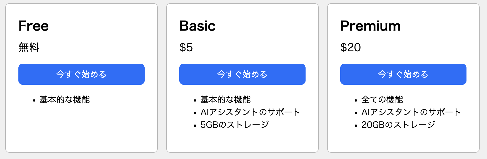

<details>
<summary>HTML のコード</summary>

```html
<!doctype html>
<html lang="ja">
  <head>
    <meta charset="utf-8" />
    <title>料金プラン</title>
    <link rel="stylesheet" href="./style.css" />
  </head>
  <body>
    <div id="container">
      <div class="card card-free">
        <div class="plan">Free</div>
        <div class="price">無料</div>
        <button type="button" class="button">今すぐ始める</button>
        <ul>
          <li>基本的な機能</li>
        </ul>
      </div>
      <div class="card card-basic">
        <div class="plan">Basic</div>
        <div class="price">$5</div>
        <button type="button" class="button">今すぐ始める</button>
        <ul>
          <li>基本的な機能</li>
          <li>AIアシスタントのサポート</li>
          <li>5GBのストレージ</li>
        </ul>
      </div>
      <div class="card card-premium">
        <div class="plan">Premium</div>
        <div class="price">$20</div>
        <button type="button" class="button">今すぐ始める</button>
        <ul>
          <li>全ての機能</li>
          <li>AIアシスタントのサポート</li>
          <li>20GBのストレージ</li>
        </ul>
      </div>
    </div>
  </body>
</html>
```

</details>

<details>
<summary>CSS のコード</summary>

```css
body {
  background-color: #f0f0f0;
}

#container {
  display: flex;
  gap: 16px;
  justify-content: center;
}

.card {
  background-color: #fff;
  width: 240px;
  border: 1px solid #bbb;
  border-radius: 8px;
  padding: 24px;
}

.plan {
  font-weight: bold;
  font-size: 24px;
}

.price {
  font-size: 20px;
  margin-top: 8px;
}

.button {
  background-color: #0d6efd;
  color: #fff;
  font-size: 16px;
  width: 100%;
  border: none;
  border-radius: 8px;
  margin-top: 16px;
  padding: 8px;
}
```

</details>

:::note

上記のコードの解説は ut.code(); Learn「[CSS によるレイアウト](https://learn.utcode.net/docs/browser-apps/css-layout/)」を参照してください。

:::

現在のところ、画面の幅を変えたときは次のような動作になっています。

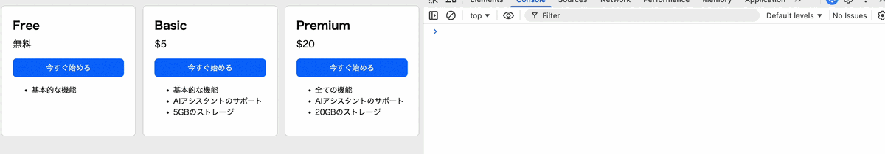

しかし、少しぎこちないですね。願わくは、次のように画面幅に合わせてカードが伸縮するようになってほしいものです。

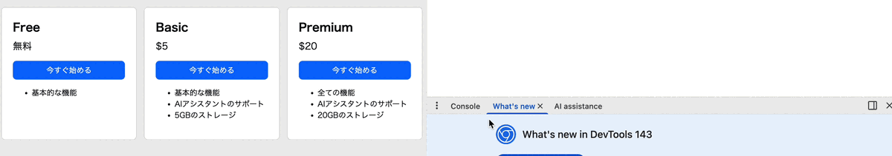

## 概要

「画面幅に合わせてカードを伸縮させる」ためにはどうすればいいでしょうか。

現状では、親要素である `#container` の幅が余っていても、子要素である `.card` の幅は小さいままになっています。

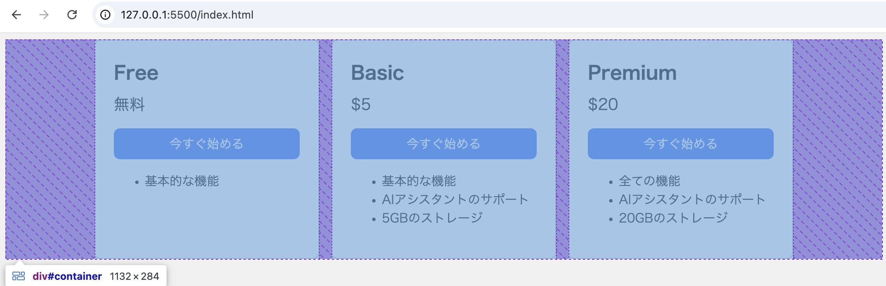

親要素の余ったスペースが子要素に分配されれば、カードは画面幅に合わせた大きさになるでしょう。このように、「コンテナ (親要素) の余っているスペースをアイテム (子要素) に分配する」際の挙動をコントロールするのが `flex-grow`、`flex-shrink`、`flex-basis` という 3 つのプロパティです。

## flex-grow

`flex-grow` プロパティの値を `1` に設定してみましょう。

```css
.card-free {
  flex-grow: 1;
}

.card-basic {
  flex-grow: 1;
}

.card-premium {
  flex-grow: 1;
}
```

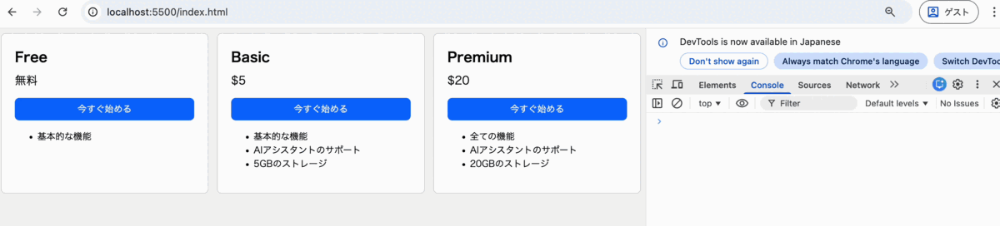

カードを広げることができました。

`flex-grow` で指定するのは、コンテナの余っているスペースがアイテム (自分) に分配される比率です。つまりここでは、Free、Basic、Premium のそれぞれのカードが、1:1:1 で余っているスペースを分配し合う、という意味になります。

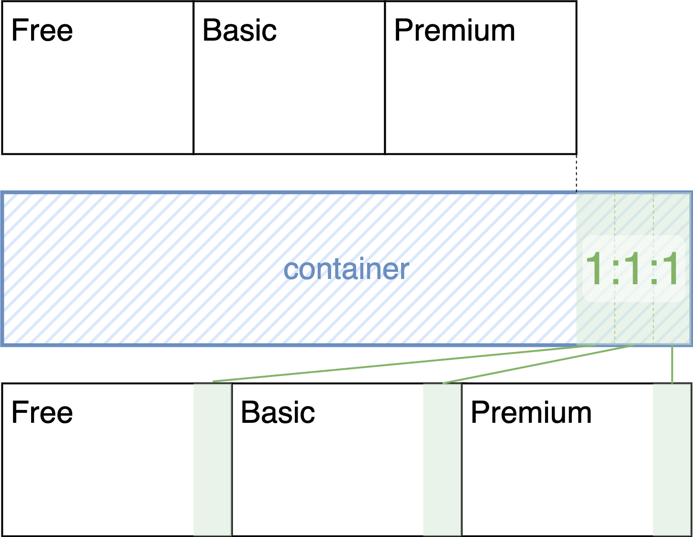

これは**他のアイテムに対する比率**です。なので、すべてのカードに同じ正の値を指定するなら、それが `flex-grow: 1` だろうが `flex-grow: 100` だろうが `flex-grow: 0.1` だろうが同じです。1:1:1 が 100:100:100 や 0.1:0.1:0.1 になるだけだからです。

では、今度はそれぞれ `0`、`1`、`2` を指定してみましょう。

```css
.card-free {
  flex-grow: 0;
}

.card-basic {
  flex-grow: 1;
}

.card-premium {
  flex-grow: 2;
}
```


Free のカードには余ったスペースが分配されず、Basic と Premium のカードにはそれぞれ 1:2 の比率で余ったスペースが分配されていることがわかります。

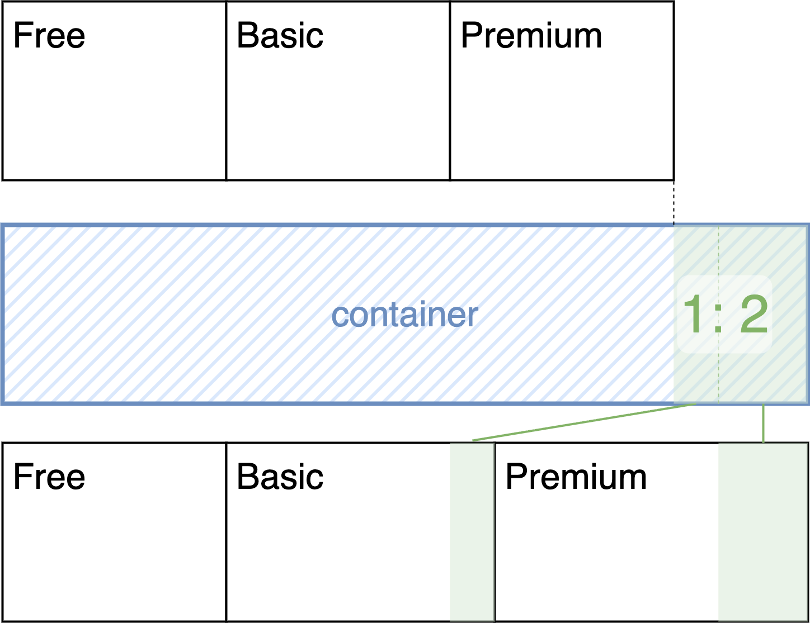

## flex-basis

`flex-basis` プロパティは、各アイテムの最初の取り分を設定するものという感じです。

今まで配分してきた「余ったスペース」は、コンテナの大きさから、各アイテムの本来の大きさを引いて求まるものでした。この「アイテムの本来の大きさ」を設定するのが `flex-basis` プロパティです。

例えば、`flex-basis` をそれぞれ `100px`、`200px`、`300px` に設定した上で、`flex-grow: 1;` を設定してみましょう。

```css
.card-free {
  flex-basis: 100px;
  flex-grow: 1;
}

.card-basic {
  flex-basis: 200px;
  flex-grow: 1;
}

.card-premium {
  flex-basis: 300px;
  flex-grow: 1;
}
```

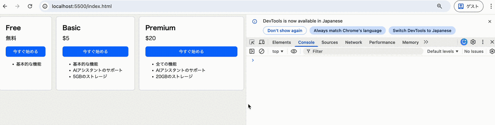

初期のサイズは 100px、200px、300px であるものの、伸びていく比率は 1:1:1 であることが確認できます。

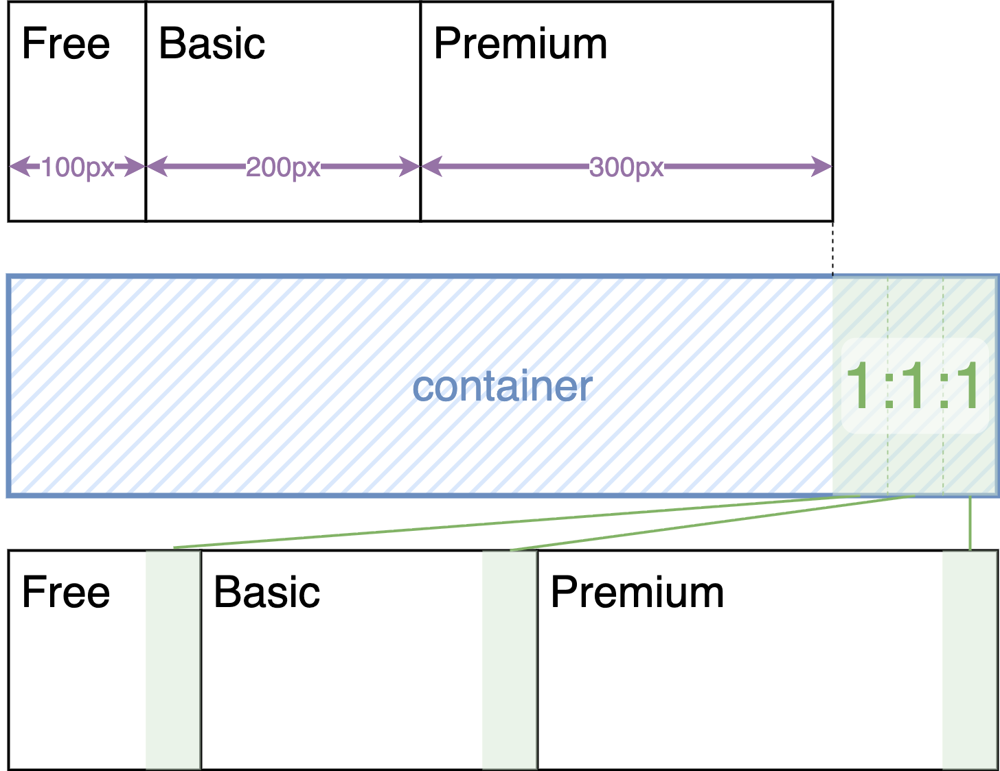

なお、`flex-basis` のデフォルト値は `auto` となっており、この場合はアイテムの `width` が本来のサイズとして使用されます。 (`flex-direction` が `column` の場合は `height` です)

## flex-shrink

`flex-shrink` プロパティは、大まかには `flex-grow` の逆で、負のスペースを分配するものと考えればいいでしょう。つまり、コンテナのスペースがアイテムの合計の大きさに対して不足している場合に、各アイテムをどう縮小するかを指定するものです。

`flex-shrink` にそれぞれ `0`、`1`、`2` を指定してみましょう。

```css
.card-free {
  flex-shrink: 0;
}

.card-basic {
  flex-shrink: 1;
}

.card-premium {
  flex-shrink: 2;
}
```

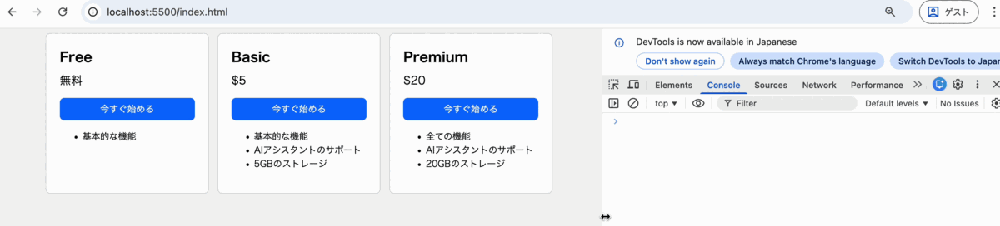

Free のカードは縮まず、Basic と Premium のカードはそれぞれ 1:2 の比率で縮んでいっていることがわかります。

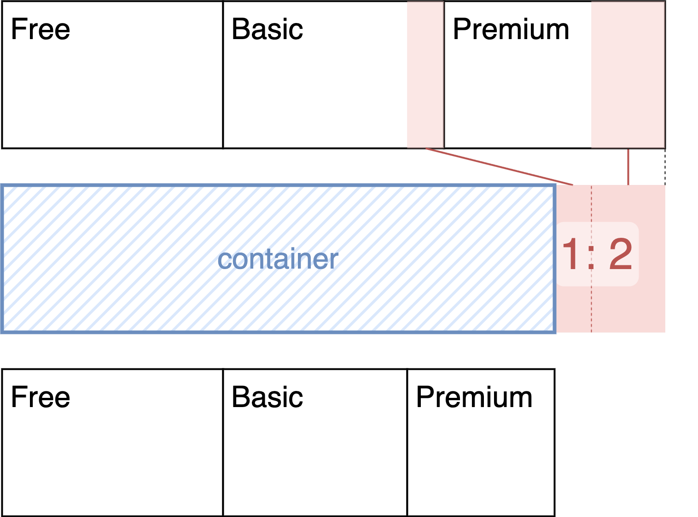

なお、このプロパティのデフォルト値は `1` なので、何も設定しなくてもスペースが不足した場合には勝手にアイテムが縮みます。

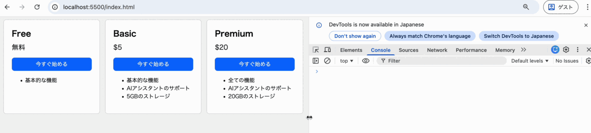

注意すべき点として、実は `flex-shrink` の比率の計算方法は `flex-grow` とは異なります。`flex-grow` の場合は、単純に各アイテムの `flex-grow` の値の比で分配されました。しかし、`flex-shrink` の場合は、各アイテムの `flex-shrink` の値に **`flex-basis` (で指定されたサイズ) を掛けたもの** の比で分配されます。そのため、`flex-basis` で指定されたサイズが均等でない場合は、`flex-shrink` の値が同じであっても、縮み方が異なります。詳しくは、[flex-shrink と flex-basis の組み合わせ - 主軸方向のフレックスアイテムの比率の制御 - CSS | MDN](https://developer.mozilla.org/ja/docs/Web/CSS/Guides/Flexible_box_layout/Controlling_flex_item_ratios#flex-shrink_%E3%81%A8_flex-basis_%E3%81%AE%E7%B5%84%E3%81%BF%E5%90%88%E3%82%8F%E3%81%9B) を参照してください。

## flex プロパティでの一括指定

`flex-grow`、`flex-shrink`、`flex-basis` の 3 つのプロパティは、`flex` プロパティを使って一括で指定することができます。

例えば、このように書くと、

```css
.foo {
  flex: 1 2 30%;
}
```

次のように各プロパティを設定したのと同じことになります。

```css
.foo {
  flex-grow: 1;
  flex-shrink: 2;
  flex-basis: 30%;
}
```

さらに短く書くこともでき、例えば

- `flex: 1;` は `flex: 1 1 0%;`
- `flex: auto;` は `flex: 1 1 auto;`
- `flex: none;` は `flex: 0 0 auto;`

の意味になります。詳細なルールは [flex - CSS | MDN](https://developer.mozilla.org/ja/docs/Web/CSS/Reference/Properties/flex) を参照してください。

## 参考

`flex-grow`、`flex-shrink`、`flex-basis` についての詳細は、[主軸方向のフレックスアイテムの比率の制御 - CSS | MDN](https://developer.mozilla.org/ja/docs/Web/CSS/Guides/Flexible_box_layout/Controlling_flex_item_ratios) を参照してください。
