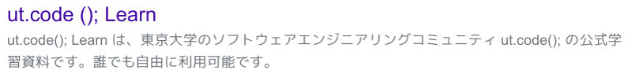
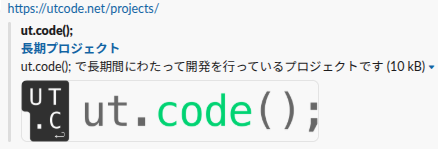

HTML の &lt;head&gt; 内に記述するメタタグや、ドメインのルートに設置する特殊なファイルによって、Google などでの検索結果の表示を改善したり、Slack・Discord や X 等にウェブサイトを共有した際の見た目を変えることができます。

## title

改めて説明する必要はないと思いますがページのタイトルです。
ブラウザーで表示した際のタイトルや、検索エンジンでの検索結果の表示に使われます。

```html title="index.html"
<title>ut.code();</title>
```

:::caution
* `<` などの記号をタイトルに含めたい場合は `&lt;` などのようにエスケープしましょう。
* ユーザーが入力したデータなどによってタイトルを動的に生成する場合は、適切にエスケープしないと XSS に利用されてしまいます。
    * 例: ユーザー名が `</title><script>alert("hello");</script>` の人がいたら
    ```html
    <title></title><script>alert("hello");</script> さんのユーザーページ</title>
    ```
* これ以降紹介する meta タグの content についても同様です。(ダブルクォーテーションの内側でもエスケープ方法は `\"` ではなく HTML のエスケープです)
:::

## description

ページの説明文を短く書くことで、検索エンジンでの検索結果の表示に使われ... る場合も使われない場合もあります。

Google では SEO 効果はないらしいです。(つまり、これを書くことにより表示順位が変わることはないということです)

```html title="index.html"
<meta name="description" content="東京大学のソフトウェアエンジニアリングコミュニティ ut.code(); の公式学習資料です。誰でも自由に利用可能です。">
```



<!-- ↑GoogleもBingも検索結果がdescriptionの文字列になっていなくて困った -->

## icon

:::caution
TODO: Bing で検索結果にアイコンが表示される条件がわからない。
:::

### favicon.ico

```html title="index.html"
<link rel="shortcut icon" href="/favicon.ico" type="image/x-icon">
```

* `rel="icon"` と書くこともあります。
* `type` は省略することもあります。

:::tip
* ファイル名は favicon.ico で、ドメインの直下に置きましょう。
それ以外のパスやファイル名を指定しても一見正しく表示されますが、
html 以外のパスをブラウザーで開いた場合 (例えば画像を新しいタブで開くなどの場合) にはメタタグが存在しないのでブラウザーは /favicon.ico を探しに行きます。
/favicon.ico にすることで常時確実に表示されるのでおすすめです。
* アイコンはかなり長い間ブラウザーや検索エンジンにキャッシュされます。アイコンを変更してすぐに反映させたい場合は、 `/favicon.ico?v=1` などのようにファイル名はそのままでもクエリパラメータを追加することで URL を変更するのが有効です。
:::

### png 形式の指定

```html title="index.html"
<link rel="icon" href="/icon-32.png" type="image/png" sizes="32x32">
<link rel="icon" href="/icon-256.png" type="image/png" sizes="256x256">
```

* このように `sizes` を設定し複数のサイズのアイコンを指定することもできます。
1種類しか用意しない場合は `sizes` は省略可能です。
* `type` は省略することもあります。

TODO: 結局なんのサイズのアイコンが必要なの?

### svg 形式の指定

```html title="index.html"
<link rel="icon" href="/icon.svg" type="image/svg+xml">
```

* `type` は省略することもあります。

### apple-touch-icon

Safari のブックマークに使用されるアイコンは上記のアイコンとは別に指定する必要があります。

```html title="index.html"
<link rel="apple-touch-icon" href="/apple-touch-icon.png" type="image/png" sizes="180x180">
```

* 1種類しか用意しない場合は `sizes` は省略可能です。
複数種類のサイズのアイコンを指定することができますが、今の iOS では 180x180 のアイコンが1つあれば十分らしいです。
* `type` は省略することもあります。

:::tip
* [ウェブマニフェスト](./t3-app-1-pwa.md)がある場合はそちらで代用でき、 `apple-touch-icon` は不要になります。
:::

## canocical / alternate

同じページを指す複数の URL がある場合 (言語違い、PC 用とモバイル用、ページ内容に影響しないクエリパラメータなど)、canonical URL を指定すると検索エンジンは検索結果をその URL に統一します。

また、言語違いのページを持つ場合は alternate URL としてそれぞれの言語の URL を指定します。

```html title="index.html"
<link rel="canonical" href="https://example.com/">
<link rel="alternate" href="https://example.com/ja/" hreflang="ja">
<link rel="alternate" href="https://example.com/en/" hreflang="en">
```

:::caution
* 検索エンジンは必ずこの指定に従うというわけではなく、canonical 指定を無視して別の URL が検索結果に表示される場合もあります。
* 複数の言語に対応するウェブサイトを作るには [Accept-Language](https://developer.mozilla.org/ja/docs/Web/HTTP/Reference/Headers/Accept-Language) ヘッダーを使ってユーザーの言語を判別し、それぞれの言語のページにリダイレクトするという方法が考えられますが、特に canonical に指定した URL がリダイレクトを返した場合 Bing はその URL を採用しません。
どうしろというんだ。
(User-Agent でクローラーを判別してその場合だけページそのものを返すとか?)
:::
<!-- TODO: ↑canonicalのもっと正しい使い方あったらだれかおしえて-->

## robots

検索エンジンのクローラーに対して、ページをインデックスするかどうかを指定します。
詳細は [標準メタデータ名 | MDN](https://developer.mozilla.org/ja/docs/Web/HTML/Reference/Elements/meta/name#%E3%81%9D%E3%81%AE%E4%BB%96%E3%81%AE%E3%83%A1%E3%82%BF%E3%83%87%E3%83%BC%E3%82%BF%E5%90%8D) を参照してください。

```html title="index.html"
<meta name="robots" content="noindex, nofollow">
```

### robots.txt

以下のような robots.txt という名前のファイルをドメイン直下に用意することで、クローラーに対してインデックスしてほしくない URL をまとめて指定することができます。

```txt title="robots.txt"
User-agent: *
Disallow: /private/
```

メタタグの robots と robots.txt ファイルが両方指定されている場合、両方でインデックスが許可されていないとインデックスされません。

## sitemap

ドメイン直下の sitemap.xml という名前のファイルでウェブサイト内のページの一覧を指定することで、検索エンジンにウェブサイト全体を確実にクロールしてもらうことができます。

詳細は [Sitemaps XML Format](https://www.sitemaps.org/protocol.html) を参照してください。

```xml title="sitemap.xml"
<?xml version="1.0" encoding="UTF-8"?>
<urlset xmlns="http://www.sitemaps.org/schemas/sitemap/0.9">
    <url>
        <loc>http://example.com/</loc>
        <lastmod>2025-01-01</lastmod>
        <changefreq>monthly</changefreq>
        <priority>0.8</priority>
    </url>
    <url>
        <loc>http://example.com/hoge/</loc>
        <lastmod>2025-01-01</lastmod>
        <changefreq>monthly</changefreq>
        <priority>0.8</priority>
    </url>
</urlset>
```

robots.txt に以下のように sitemap を指定することで、クローラーに sitemap.xml の場所を教えることができます。

```txt title="robots.txt"
User-agent: *
Disallow: /private/
Sitemap: https://example.com/sitemap.xml
```

新しく作られたウェブサイトでまだ存在が認知されていない場合は、Google Search Console や Bing Webmaster Tools にサイトマップを送信することで早くクロールしてもらうことができます。

## OGP

OGP (Open Graph Protocol) のタグを指定することで、Slack や Discord、Facebook などでウェブサイトを共有した際の見た目を変えることができます。

```html title="index.html"
<meta property="og:プロパティ名" content="内容">
```
の形式で指定します。

https://web-toolbox.dev/tools/ogp-checker や https://develop.tools/ogp-simulator/ などの OGP チェッカーを使って動作確認できます。

参考: [The Open Graph protocol](https://ogp.me/)

例:
    
```html
<title>長期プロジェクト | ut.code();</title>
<meta name="description" content="ut.code(); で長期間にわたって開発を行っているプロジェクトです">
<meta property="og:site_name" content="ut.code();">
<meta property="og:title" content="長期プロジェクト">
<meta property="og:description" content="ut.code(); で長期間にわたって開発を行っているプロジェクトです">
<meta property="og:image" content="https://utcode.net/utcode-logo/normal.png">
<meta property="og:url" content="https://utcode.net/projects/">
<meta property="og:locale" content="ja_JP">
<meta name="twitter:card" content="summary_large_image">
<meta name="twitter:site" content="@utokyo_code">
```



### og:title (必須)

ページのタイトルを指定します。

### og:sitename

ウェブサイトの名前を指定します。
一般的に og:title と同時に og:sitename が表示されるので、&lt;title&gt;にサイト名が含まれる場合でも og:title にサイト名を含める必要はありません。

### og:description

ページの説明文を指定します。省略した場合は description が代わりに使われることもある?

### og:type (必須)

通常は `website` を指定します。
他には `article`, `book`, `profile`, `video`, `audio` などが指定可能で、その場合は追加で指定が必要なプロパティがあります。

### og:image (必須)

プレビューに表示する画像を指定します。
画像形式は PNG, JPEG, GIF, WEBP が指定可能です。
サイズは 1200x630px が推奨されています。

:::caution
* og:image に指定するURLは https:// から始まる絶対 URL で指定する必要があります。
* og:image を指定しなかった場合の動作はアプリの実装によります。
参考:[LINEくん？OGPの設定をしてないのにOGが出るんだが？ | Qiita](https://qiita.com/Takayuki_Nakano/items/e87c2d4af20e0dbfdec5)
* Twitter (現在の X), Discord で表示される画像サイズは twitter:card プロパティの設定によって変わります。
:::

### og:url (必須)

ページの canonical URL を指定します。
Facebook ではいいね数の集計に使われるらしいです。
それ以外のアプリで何に使われるのかは謎ですが必須となっています。

## Twitterカード

Twitter (現在の X) でウェブサイトを共有した際の見た目を変えるためのプロトコルです。
現在は twitter:card, site, creator 以外の要素は OGP で代用できます。
Xカード とは呼びません。

```html title="index.html"
<meta name="twitter:プロパティ名" content="内容">
```
の形式で指定します。
(OGP とは異なり、`property` ではなく `name` で指定します)

参考: [カードの利用開始 | Docs | Twitter Developer Platform](https://developer.x.com/ja/docs/tweets/optimize-with-cards/guides/getting-started)

### twitter:card (必須)

Twitterカードの種類を指定します。
`summary`, `summary_large_image`, `app`, `player` の4種類があり、通常は `summary_large_image` を指定します。
この指定によって X 上でプレビューの種類が変わります。

また、Discord でもこの設定によってプレビューに表示される画像のサイズが変わるようです。

### twitter:site

このウェブサイトを運営している X アカウントを (`@` をつけて) 指定します。

### twitter:creator

このページのコンテンツの作者の X アカウントを (`@` をつけて) 指定します。
