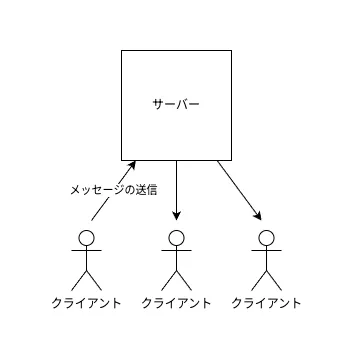

# SSE (Server-Sent Events) の動く仕組み

## リアルタイムチャットアプリを作る

**リアルタイムチャットアプリ**を作ってみましょう。あるクライアントがメッセージを送ったとき、その送信のイベントを他のクライアントに送信したいです。



## 現状の制限

しかし、そもそも HTTP の通信はクライアント -> サーバーへのリクエストとそのレスポンスしか許可していません。
では、どのようにすれば、サーバーからクライアントにイベントを飛ばせるでしょうか。

## Server-Sent Events という決めごと

ひとつのやりかたとして、最初にクライアントにリクエストを発行させておいて、そのレスポンスという形でイベントを送信することが考えられます。

イベントを送るごとにリクエストを再び発行させる方法もありますが、SSE では同じレスポンスハンドルを複数のイベントで使いまわします。

```text
> GET /sse HTTP/1.1

< Content-Type: text/event-stream
<
< event: message
< data: {"content":"Hello!","timestamp":"2025-05-01 22:00"}
< 
< event: message
< data: {"content":"Anybode there?","timestamp":"2025-05-01 22:03"}
<
```

各イベントは、改行二つで区切られています。

## サーバーの実装

サーバーサイドは Hono の `stream` ヘルパーを使って実装します。

```ts title="server.ts"
import { Hono } from "hono";
import { stream } from "hono/stream";

const app = new Hono().get("/sse", (c) => {
  c.header("Content-Type", "text/event-stream");
  return stream(c, async (stream) => {
    let time = 0;
    while (true) {
      await stream.write(`event: ping\ndata: ${++time}\n\n`);
      await stream.sleep(2000);
    }
  });
});
```

サーバー側がどういう挙動をとるのか確認してみましょう。 **Chromium 系** ブラウザまたは cURL で、`http://localhost:3000/sse` にリクエストを飛ばし、ネットワークタブからどのようなレスポンスが返ってきているのか見てみましょう。

:::caution

Firefox の開発者ツールはイベントストリームの可視化ができません。 Chromium 系のブラウザを使いましょう。

:::

(FIXME: 誰か動画貼って)

## クライアントの実装

次は、クライアント側を実装します。

手動で fetch API の `body` を順に解読してもいいですが、 `EventSource` という Web API が提供されているので、それを使ってイベントストリームをデコードしましょう。

```js title="client.js"
// @ts-check
const src = new EventSource("http://localhost:3000/sse");

// `event:` で指定したイベントが発火するので、 listener をつけてやる
src.addEventListener("ping", (ev) => {
  // `ev.data` プロパティで `data:`で指定されたデータが取得できる
  console.log(ev.data);
  document.body.textContent += `${ev.data} `;
})
```


## 演習問題

では、ここまで得た知識を使って、リアルタイムチャットアプリを作ってみましょう。

質問や解答例は Discord などで聞けば誰かが答えてくれます。多分。

### ヒント

サーバー上で、一個のイベントに複数個のリスナーをつける必要が出てくるはずです。

[`BroadcastChannel`](https://developer.mozilla.org/ja/docs/Web/API/BroadcastChannel) や [`EventEmitter (Node.js)`](https://nodejs.org/en/learn/asynchronous-work/the-nodejs-event-emitter) などの Pub/Sub メッセージングモデルが使いやすいでしょう。

## おまけ (ベストプラクティス)

`EventSource` は、 使い終わったら `.close` メソッドで閉じましょう。

```svelte {7}
<script lang="ts">
  import { onMount } from "svelte";
  onMount(() => {
    const source = new EventSource("http://localhost:3000/sse");
    // use source...

    return () => source.close();
  });
</script>
```

## よくあるミス / 引っかかりやすいポイント

- HTTP 2.0 未満だと、**ブラウザ**ごとに同じドメインに 6 個までの接続制限がかかる。 [出典](https://developer.mozilla.org/ja/docs/Web/API/EventSource)

## 出典

[サーバー送信イベント | MDN](https://developer.mozilla.org/ja/docs/Web/API/Server-sent_events)

[EventSource | MDN](https://developer.mozilla.org/ja/docs/Web/API/EventSource)
