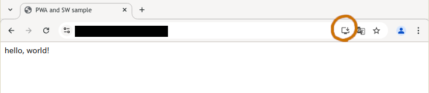
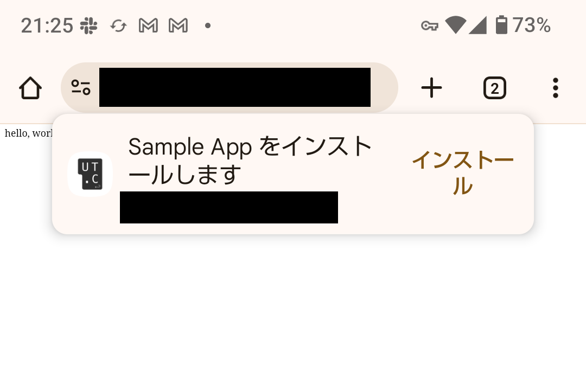
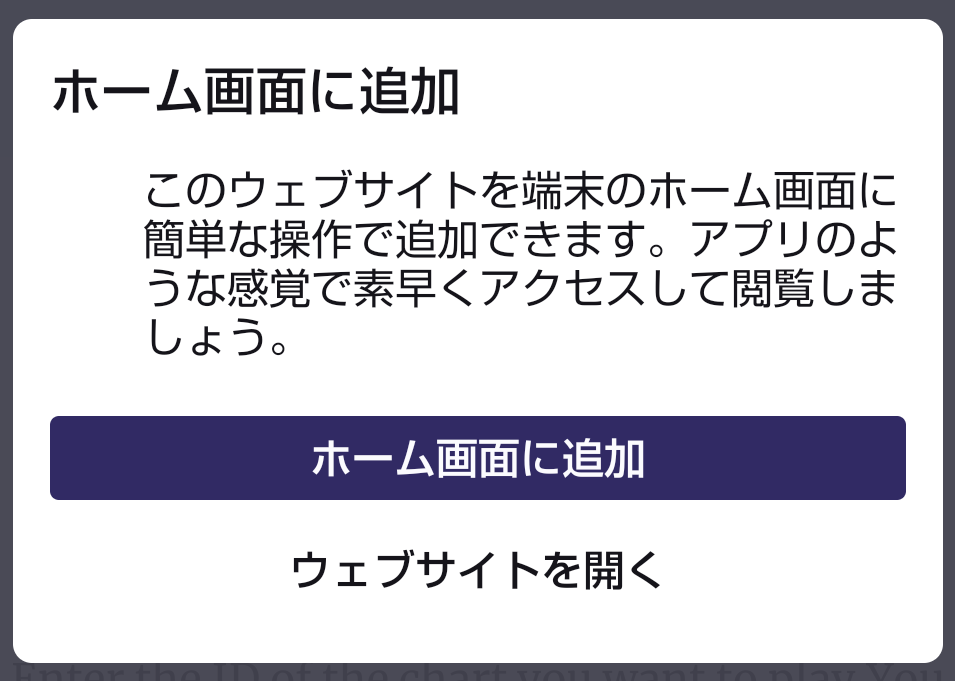

PWA (Progressive Web App) は、ウェブサイトをブラウザー内で利用するのではなく、端末にインストールしてアプリのように利用することができる技術です。
端的に言えばウェブサイトのブックマークをホーム画面に置くのと同じような感じですが、 PWA は単なるブックマークとは違いブラウザーとは独立した画面で (つまり、フルスクリーンで) 開きます。

## PWA を作る

ウェブサイトを PWA として認識されるようにするために必要なのは、ウェブアプリマニフェストと呼ばれる json ファイルと、それを指定する HTML ファイル内のメタタグです。

ここでは例として、ウェブサイトが以下のような HTML ファイル1つからなるとします。

```html title="index.html"
<html>
  <head>
    <title>Sample App</title>
  </head>
  <body>
    hello, world!
  </body>
</html>
```

### ウェブマニフェスト

このウェブサイトを PWA にするためには、まず以下のような内容の「manifest.json」ファイルを作成します。

```json title="manifest.json"
{
  "name": "Sample App",
  "short_name": "Sample",
  "start_url": "/",
  "id": "/",
  "display": "standalone",
  "theme_color": "#80ffff",
  "background_color": "#ffff80",
  "icons": [
    {
      "src": "/icon_192.png",
      "sizes": "192x192",
      "type": "image/png",
      "purpose": "any maskable"
    },
    {
      "src": "/icon_512.png",
      "sizes": "512x512",
      "type": "image/png",
      "purpose": "any maskable"
    }
  ]
}
```

そして、HTML の &lt;head&gt; 内に以下のようにマニフェストファイルの URL を記述します。

```html title="index.html"
<link rel="manifest" href="/manifest.json">
```

マニフェストファイルの内容としては上の例に示した中でも `name`, `start_url`, `display`, `icon` が必須項目です。
詳細は [ウェブアプリ マニフェスト | web.dev](https://web.dev/learn/pwa/web-app-manifest?hl=ja) や [PWA をインストール可能にする | MDN](https://developer.mozilla.org/ja/docs/Web/Progressive_web_apps/Guides/Making_PWAs_installable) を参照してください。

:::tip
* マニフェストファイルのファイル名や配置するパスに決まりはありませんが、「manifest.json」や「〜.webmanifest」がよく用いられます。
* 複数のページからなるウェブサイトの場合、すべてのページにマニフェストファイルのlinkタグを記述する必要があります。
* 生で HTML を書かずにフレームワークを使う場合、静的なアセットとしてマニフェストファイルを置いてもよいですが、フレームワークの API でマニフェストを作成する機能が用意されている場合もあります。
:::

### アイコン

端末のホーム画面に表示されるアプリアイコンを用意する必要があります。
アイコンはマニフェストファイルの `icons` で指定します。
**192x192 と 512x512 のアイコン画像は最低限必須**です。

Android ではアプリアイコンの形が丸や角丸など異なる場合があります。
これに対応させるために、 `purpose` を `maskable` に設定したマスク可能なアイコンを用意する必要があります。
マスク可能なアイコンは、OS 側によって周囲がカットされても構わないよう、アイコンのメインの部分が直径約 80% の円の内側に収まるようにデザインします。
また画像は透過でないほうがよいらしいです。


PC などその他の環境ではそのようなパディングは必要ないので、 `purpose` を `any` に設定した通常のアイコンも用意します。
複数種類のアイコンを用意するのが面倒な場合は前述の例のように `any maskable` とすることもできます。

最低でも1つ以上は `purpose` が `any` のアイコンが必須です。(サイズは問わないらしい?)

iOS ではウェブマニフェストとは別に HTML のメタタグで `apple-touch-icon` を指定する必要があると書かれている記事が多いですが、この記事を書いている現在 (2025年4月) iOS 18 で試してみたところウェブマニフェストだけでも正しくアイコンが表示されました。

### テーマカラー

マニフェスト内の `theme_color` はアプリのテーマカラーを指定します。
ここで指定した色は、ウェブサイトを PWA としてインストールしたあと、Android や iOS ではステータスバーの色に、PC ではタイトルバーの色に反映されます。
また、iOS と Mac の Safari 及び Android の Chrome では、普通にウェブサイトとして開いた際にもアドレスバーの色に反映されます。

`background_color` は PC および Android でアプリが起動してから最初のページが読み込まれるまでの間表示される背景色に反映されます。
(iOS では反映されず、ライトモードでは白に、ダークモードでは黒になりました)

テーマカラーは HTML ファイルの &lt;head&gt; の中でも指定することができます。
マニフェストと HTML ファイルの両方で指定した場合、HTML 側の値が優先され、ページごとに色を変えることも可能です。
(ただし、アプリが起動してから最初のページが読み込まれるまでの間はマニフェストに指定した値が使用されることになります。)

```html
<meta name="theme-color" content="#80ffff">
```

HTML ファイル内で指定されたテーマカラーは JavaScript で書き換えることもでき、実際の表示にも反映されます。

```js
document.querySelector('meta[name="theme-color"]').setAttribute("content", "#002020");
```

さらに、HTML ファイル内では以下のように記述すると OS がダークモードの場合のテーマカラーも指定することができます。

```html
<meta name="theme-color" content="#80ffff" media="(prefers-color-scheme: light)">
<meta name="theme-color" content="#002020" media="(prefers-color-scheme: dark)">
```

:::tip
現在のところウェブマニフェストの側でダークモード用のテーマカラーや背景色を指定する方法はありません。
W3C において現在[議論中](https://github.com/w3c/manifest/issues/975)のようです。
:::

## PWA のインストール

以上のようにマニフェストファイルが正しく用意されていれば、ウェブサイトを PWA としてインストールできるはずです。
マニフェストの記述に間違いがないかを確認するには、まず PC の Chrome でインストールできるかどうかを確かめましょう。

なお PWA をインストールするには、ウェブサイトが HTTPS または localhost (ポートは任意) でホストされている必要があります。
PC での動作確認は localhost で行えばよいですが、スマホ等別の端末での動作確認をするには https が使えるようにデプロイする必要があります。

### PC の Chrome の場合

PC の Chrome 及び Edge では、PWA に対応したウェブサイトを開くと、アドレスバーの右側に「インストール」ボタンが出現します。
Chromium ベースの他のブラウザでは仕様が異なる場合があるため、まず Chrome か Edge での動作確認をおすすめします。

:::caution
マニフェストの記述が間違っていたり必須の項目が不足している場合、インストールボタンが表示されません。
その場合は開発者ツールの「Application」タブを開くとエラーや warning の表示を確認できます。
:::



### Android の場合

Android の Chrome や Firefox などではこのようにポップアップでインストールの表示が出ます。
ただし必ず出るわけではなく、リロードすると2度目以降は出なかったり、逆に初回は出てこずリロードすると突然出てくることもあります。




ポップアップが表示されない場合、ブラウザのメニューから「ホーム画面に追加」を選択することでもインストールできます。
「ホーム画面に追加」自体は PWA に対応していないウェブサイトでも可能ですが、PWA の場合は追加されるアプリのアイコンや名前にウェブマニフェストで指定したものが反映されます。

### iOS の場合

iOS では PWA のインストールに関するボタンやポップアップはありません。
Safari でウェブサイトを開き共有ボタンを押し、「ホーム画面に追加」を選択することでインストールできます。
「ホーム画面に追加」自体は PWA に対応していないウェブサイトでも可能ですが、PWA の場合は追加されるアプリのアイコンや名前にウェブマニフェストで指定したものが反映されます。

### インストールボタンを自前で用意する

PC と Android の Chrome では、PWA のインストールのポップアップを JavaScript から呼び出すことができます。
そのため、ウェブサイト内にインストールボタンを設置することで、 Android ユーザーのエクスペリエンスを向上できます。

(iOS ユーザーと Chrome 以外のブラウザについてはそのような API は実装されておらず、ブラウザの ホーム画面に追加 ボタンを押すよう誘導するくらいしかできません)

JavaScript から PWA のインストールを呼び出すには、まず `beforeinstallprompt` イベントのイベントハンドラを作成します。
そのイベントハンドラでは、引数に渡されるイベントオブジェクト ([BeforeInstallPromptEvent](https://developer.mozilla.org/en-US/docs/Web/API/BeforeInstallPromptEvent)) を変数に保存します。

```html title="index.html"
<script>
  let installPrompt;
  window.onbeforeinstallprompt = (event) => {
    // event を変数に保存する
    installPrompt = event;
    // ブラウザがデフォルトで表示するインストールのポップアップを無効化
    event.preventDefault();
  };
</script>
```

そして、インストールボタンが押されたときに BeforeInstallPromptEvent の `prompt()` を呼び出すと、PWA をインストールするポップアップが表示されます。
ポップアップ表示後、ユーザーが実際にインストールしたかどうかを `userChoice` で取得できます。

```html title="index.html"
<button id="install-button">インストール</button>
<script>
  document.getElementById("install-button").onclick = () => {
    if (installPrompt) {
      installPrompt.prompt();
      installPrompt.userChoice.then((choiceResult) => {
        if (choiceResult.outcome === "accepted") {
          console.log("ユーザーがインストールを承認しました");
          // todo: インストールボタンを非表示にするなどの処理を入れる
        } else {
          console.log("ユーザーがインストールを拒否しました");
        }
      });
      // prompt() は2回以上呼び出すことはできないので、捨てます
      installPrompt = null;
    }
  };
</script>
```

すでにこのウェブサイトをインストール済みの環境では `beforeinstallprompt` イベントは呼び出されません。
そのため実用上はこのイベントが呼び出されたときにのみインストールボタンなどのUIが現れるようにするとよいでしょう。

### ネイティブアプリに変換する

PWA はアプリストアなどを経由せずクロスプラットフォームなアプリを配布できる新しい技術ですが、やはりアプリはアプリストアからインストールするものというイメージを持ったユーザーも多いです。
そのため、 PWA をネイティブアプリに変換してアプリストアに登録することが考えられます。

[PWABuilder](https://www.pwabuilder.com) というツールは、PWA に対応したウェブサイトを App Store, Google Play, Microsoft Store などに配布できる形のアプリに変換することができます。

:::caution
実際にこれを使ってアプリを作ったことはまだないので、そのうち誰かが追記?
:::
